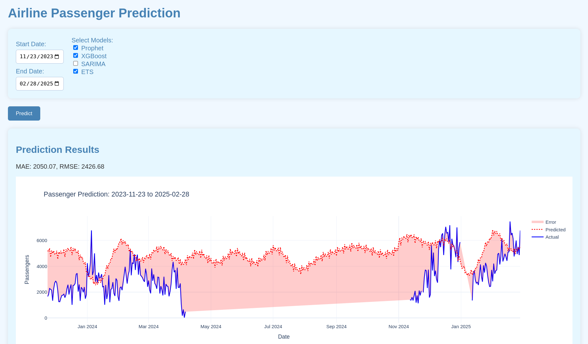

# Fusion model
Time series prediction of real world data which in reality affected by many factors but they are not seen, so some safictication should be used here. Using just simple ARIMA or XGboost is not a good option. 
Model uses daily airtraffic - number of passangers, which it tries to predict with several tecniques blinded together into one model. 
Among many other examples, particulary was implemented: (Prophet + XGBoost) with a Flask web service.

### SubModels
Models are fused into one by just finding average. Ideally it should be tuned for each particular case. 
```python
np.mean([prophet_pred.values, xgb_pred, sarima_pred.values, ets_pred.values])
```
You can choose which combination of models works the best way for you, for example, by choosing the least error or you might be interested in jusrt prediction a particular time window

### Base Models Selection
- Prophet/Neural Prophet: Handles holidays, seasonality, and abrupt changes.
- XGBoost/LightGBM: Utilizes engineered features (e.g., lags, rolling statistics).
- SARIMA/ETS: For linear trends, seasonality, and stationarity.
You might also want to add:
- LSTM/GRU Networks: Models complex non-linear patterns and long-term dependencies.

### Installation
```
pip install flask pandas numpy plotly prophet xgboost holidays statsmodels
```
or
```
python3.12 -m pip install flask pandas numpy plotly prophet xgboost holidays statsmodels
```

## Results
Only some periods are enough to train the model. 
After Training it fills in gaps nicely

