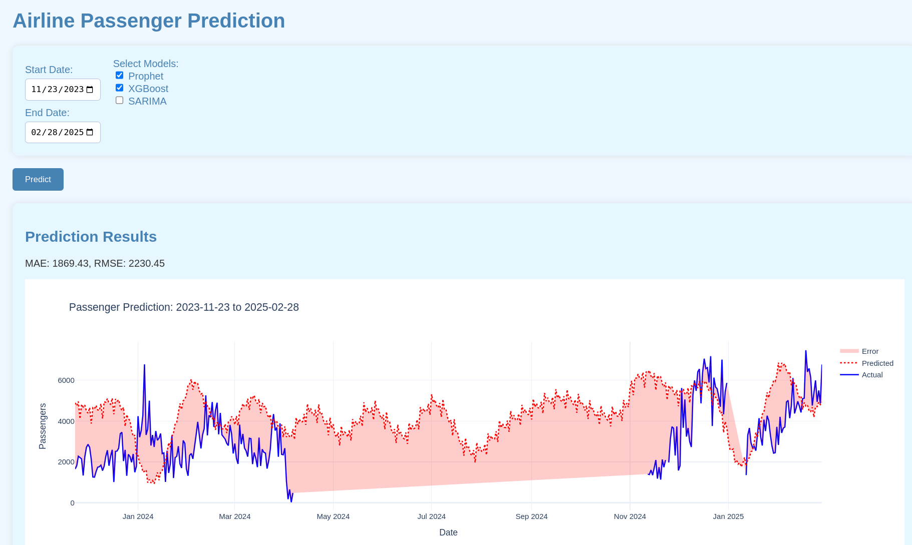

# Fusion model
Time series prediction of real world data which in reality affected by many factors but they are not seen, so some safictication should be used here. Using just simple ARIMA or XGboost is not a good option. 
Model uses daily airtraffic - number of passangers, which it tries to predict with several tecniques blinded together into one model. 
Among many other examples, particulary was implemented: (Prophet + XGBoost) with a Flask web service.

### SubModels
2 Models are fused into one by just finding average. Ideally it should be tuned for each particular case. 
```python
(prophet_pred.values + xgb_pred) / 2
```

## Installation
```
pip install flask pandas numpy plotly prophet xgboost holidays statsmodels statsforecast
```
or
```
python3.12 -m pip install flask pandas numpy plotly prophet xgboost holidays statsmodels statsforecast
```

## Results
Only some periods are enough to train the model. 
After Training it fills in gaps nicely

